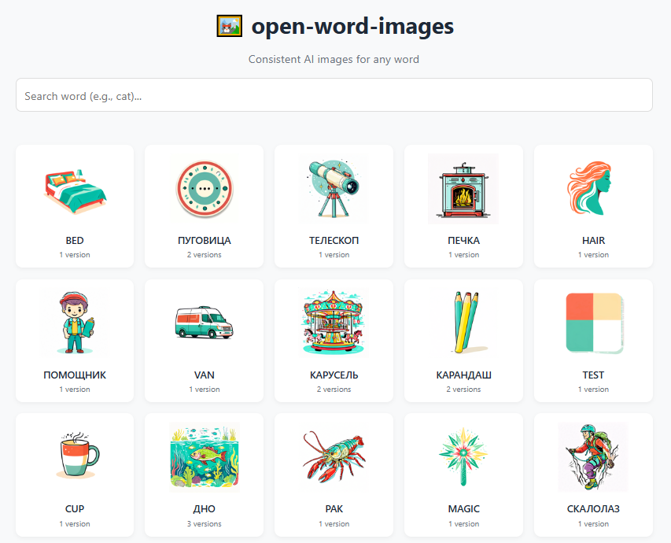

# 🖼️ open-word-images

Open-source library of AI-generated word images. Consistent style, versioned, free to use.



## ✨ Key Features

- **Cross-language** - Words in different languages can share the same image (e.g., "кот" + "cat" → same concept)
- **Versioned** - Each word has v1, v2, v3... track evolution over time
- **Best selection** - Human-picked best version per word (annotator tool)
- **Reproducible** - Every version has its prompt recorded
- **Auto-versioning** - Push new images → workflow auto-creates versions + thumbnails
- **Manifest-driven** - Single `manifest.json` controls everything

## 👀 Browse Images

**Live preview:** https://krivich.github.io/open-word-images/

Use the browser to explore all concepts and versions. Annotator is at the same domain.

## 🎯 Quick Start (For Users)

### Embed image by word

```html
<!-- Specific version -->


<!-- For "always latest" - client must read manifest.concepts[word].styles.default.latest -->
<!-- Then construct: cat_v${latest}.png -->
```

### Use in your app

Fetch the manifest to get `best` version for each word:

```javascript
const manifest = await fetch('manifest.json').then(r => r.json());
const word = manifest.concepts['cat'];
const bestVersion = word.styles.default.best;  // e.g., 3
const imageUrl = `styles/default/cat_v${bestVersion}.png`;
```

## 📁 Project Structure

```
/
├── manifest.json          # All concepts, versions, prompts
├── manifest_demo.json  # Demo subset (50 concepts)
├── index.html         # Image browser
├── annotate.html    # Version reviewer - select best versions
├── styles/
│   └── default/
│       ├── cat_v1.png       # Version 1 (N = 1)
│       ├── cat_v2.png       # Version 2 (N = 2)
│       ├── cat_v3.png       # Version 3 (N = 3)
│       ├── words.py        # Prompt overrides: {"word": "prompt..."}
│       └── thumbs/        # Auto-generated thumbnails
├── scripts/
│   ├── process_images.py
│   └── apply_migration.py
└── .github/workflows/
    ├── update-manifest-v2.yml   # Auto-version new images
    └── apply-migration.yml      # Apply version migrations
```

## 🔄 Contributing New Images

### 1. Add images

Upload new PNGs to `styles/default/`. Filename must match the word:

```
styles/default/cat.png → will become cat_v1.png
```

### 2. Add prompts (optional)

Edit `styles/default/words.py` to add prompts for new words. Keys must match filenames (without .png):

```python
words = {
    "cat": "single cat, sitting with pointed ears and whiskers",
    "dog": "single dog, standing with tail up"
}
```

Here `cat` matches `styles/default/cat.png` → becomes `cat_v1.png`.

### 3. Push

The workflow automatically:
- Versions new images (`word_v1.png`, `word_v2.png`...)
- Generates thumbnails (`thumbs/128/`, `thumbs/256/`, `thumbs/512/`)
- Updates `manifest.json`

### 4. Review & Select Best Versions

1. Open `annotate.html`
2. Browse concepts, select best versions using keyboard:
   - `↑` `↓` - navigate
   - `←` `→` - switch version
   - `Space` - toggle selection
   - `R` - reset to latest
3. Click "📤 Export Migration"
4. Push `manifest-migration.json` to trigger apply workflow

## 🛠️ Available Tools

### Annotator (`annotate.html`)

Version reviewer. Select best versions for each concept.

**Controls:**
- `↑` `↓` - navigate rows
- `←` `→` - navigate versions
- `Space` - select/deselect version
- `R` - reset to latest
- `Home` / `End` - first/last row

**Filter:** "Только без best" shows only unreviewed concepts.

### Process Images (`scripts/process_images.py`)

Auto-versioning script. Runs on every push to `styles/default/`.

```bash
# Run locally
python scripts/process_images.py
```

What it does:
1. Finds unversioned PNGs in `styles/default/`
2. Renames to `word_v1.png`, `word_v2.png`, etc.
3. Generates thumbnails
4. Builds `manifest.json`

### Apply Migration (`scripts/apply_migration.py`)

Applies version selections to manifest:

```bash
# Preview changes
python scripts/apply_migration.py --dry-run

# Apply
python scripts/apply_migration.py

# Skip hash check
python scripts/apply_migration.py --skip-hash-check
```

### GitHub Actions

| Workflow | Trigger | Action |
|----------|---------|--------|
| `update-manifest-v2.yml` | Push to `styles/default/` | Auto-version images, update manifest |
| `apply-migration.yml` | Push `manifest-migration.json` | Apply version selections |

## 📜 Manifest Format

```json
{
  "version": "2.0",
  "concepts": {
    "cat": {
      "default_style": "default",
      "styles": {
        "default": {
          "latest": 3,
          "best": 2,
          "versions": [
            { "n": 1, "path": "default/cat_v1.png", "prompt": "..." },
            { "n": 2, "path": "default/cat_v2.png", "prompt": "..." },
            { "n": 3, "path": "default/cat_v3.png", "prompt": "..." }
          ]
        }
      }
    }
  },
  "words": {
    "cat": { "concept": "cat", "language": "eng", "pos": null }
  }
}
```

## 📜 License

- **Images:** CC0-1.0 (Public Domain)
- **Code:** MIT