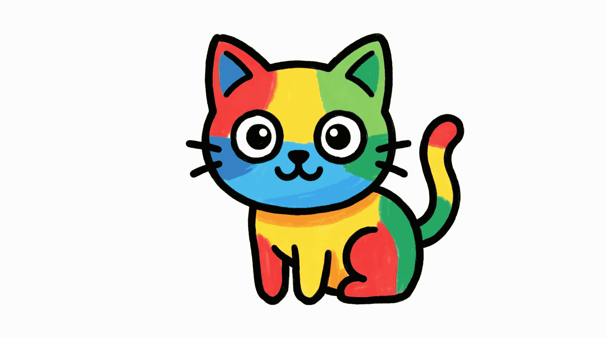

# Style: Flat Vector (Primary Colors)

## Base Prompt
```
[OBJECT] icon for learning apps,
flat vector style, thick black outline (3px),
white background, minimalist, no shading,
primary colors only: #FF0000 red, #0099FF blue, #FFCC00 yellow, #33CC33 green,
educational clipart, isolated object, simple geometric shapes,
clean lines, children's illustration style
```

## Parameters
- **Size:** 1024x1024
- **Format:** PNG with white background
- **Colors:** Strictly from palette above
- **Outline:** Thick black, consistent weight
- **No:** Gradients, shadows, textures, realistic details

## Version History
- **v1.0** (2024-01): Initial style definition

## Example

